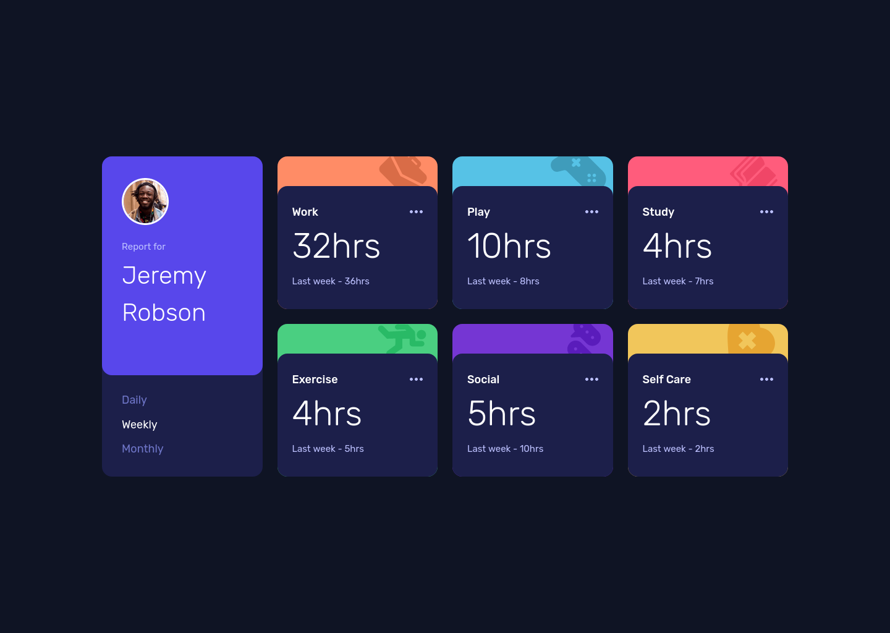

# Frontend Mentor - Time tracking dashboard solution

This is a solution to the [Time tracking dashboard challenge on Frontend Mentor](https://www.frontendmentor.io/challenges/time-tracking-dashboard-UIQ7167Jw). Frontend Mentor challenges help you improve your coding skills by building realistic projects. 

## Table of contents

- [Overview](#overview)
  - [The challenge](#the-challenge)
  - [Screenshot](#screenshot)
  - [Links](#links)
- [My process](#my-process)
  - [Built with](#built-with)
  - [What I learned](#what-i-learned)
  - [Useful resources](#useful-resources)
- [Author](#author)

## Overview

### The challenge

Users should be able to:

- View the optimal layout for the site depending on their device's screen size
- See hover states for all interactive elements on the page
- Switch between viewing Daily, Weekly, and Monthly stats

### Screenshot

### Links

- Solution URL: [GitHub](https://github.com/GrzywN/time-tracking-dashboard-main)
- Live Site URL: [Netlify](https://shimmering-malabi-aead90.netlify.app/)

## My process

### Built with

- Semantic HTML5 markup
- CSS3, Flexbox, CSS Grid
- Mobile-first workflow

- [React](https://reactjs.org/) - JS library
- [Framer Motion](https://www.framer.com/motion/) - React animation library
- [Tailwind CSS](https://tailwindcss.com/) - CSS framework
- [Vite](https://vitejs.dev/) - Bundler / Runtime
- [Vitest](https://vitest.dev/) - Testing library
- [ESLint](https://eslint.org/) - Linter
- [Prettier](https://prettier.io/) - Code formatter

### What I learned

I learned a lot, since it was my first React project. Maybe components are too big and code isn't the cleanest, but I'm really happy with the final result.

### Continued development

Maybe I'll come back some time to my older projects to refactor them.

### Useful resources

- [Tailwind Cheat Sheet](https://nerdcave.com/tailwind-cheat-sheet)
- [Framer Motion for React Tutorial](https://www.youtube.com/playlist?list=PL4cUxeGkcC9iHDnQfTHEVVceOEBsOf07i)
- [React - The Complete Guide (incl Hooks, React Router, Redux)](https://www.udemy.com/course/react-the-complete-guide-incl-redux/)

## Author

- Frontend Mentor - [@GrzywN](https://www.frontendmentor.io/profile/GrzywN)
- Twitter - [@GrzywN](https://www.twitter.com/GrzywN)
